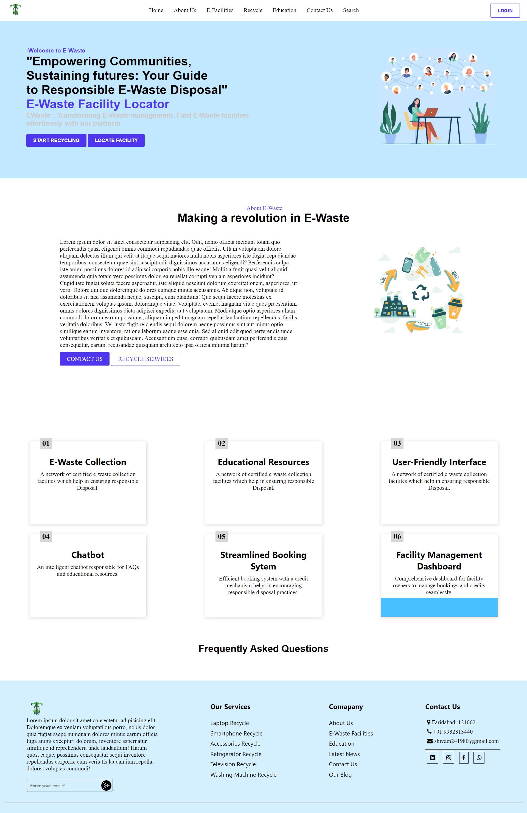

# E-Waste Management System
# E-Waste Management System



## Overview
The E-Waste Management System is a project aimed at developing an efficient and sustainable solution for managing electronic waste. The system provides a platform for users to dispose of their electronic waste responsibly while promoting recycling and environmental conservation.

## Features
- **User Registration and Authentication**: Users can create accounts and log in securely to access the system.
- **E-Waste Collection Points**: The system maintains a database of authorized e-waste collection points where users can drop off their electronic waste.
- **E-Waste Pickup Requests**: Users can request pickup services for their e-waste from their location, making disposal more convenient.
- **E-Waste Tracking**: The system tracks the status of e-waste from pickup to disposal, ensuring transparency and accountability.
- **Educational Resources**: The system provides educational resources and tips on responsible e-waste disposal and recycling.
- **Administrator Dashboard**: Administrators have access to a dashboard for managing users, collection points, pickup requests, and monitoring system activity.

## Technologies Used
- **Frontend**: HTML, CSS, JavaScript
- **Backend**: Python, Django Framework
- **Database**: sqlite3
- **Authentication**: Django Authentication System
- **Maps Integration**: Leaflet Maps API
- **Version Control**: Git, GitHub

## Installation
1. Clone the repository:
   ```
   git clone https://github.com/yourusername/e-waste-management.git
   ```

2. Install dependencies:
   ```
   pip install -r requirements.txt
   ```

3. Set up the database:
   ```
   python manage.py migrate
   ```

4. Create a superuser:
   ```
   python manage.py createsuperuser
   ```

5. Run the development server:
   ```
   python manage.py runserver
   ```

6. Access the application at `http://localhost:8000`.

## Contributing
Contributions are welcome! If you'd like to contribute to the project, please follow these steps:
1. Fork the repository.
2. Create a new branch for your feature or bug fix.
3. Make your changes and commit them.
4. Push to your fork and submit a pull request.

## Acknowledgements
- [Django Documentation](https://docs.djangoproject.com/en/stable/)
- [Google Maps API Documentation](https://developers.google.com/maps/documentation)
- [Font Awesome](https://fontawesome.com/) for icons

---
